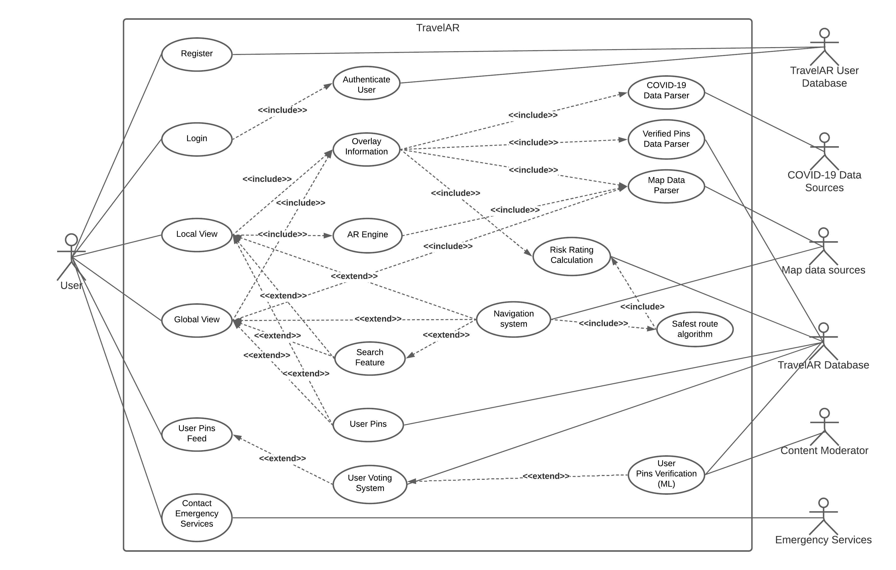
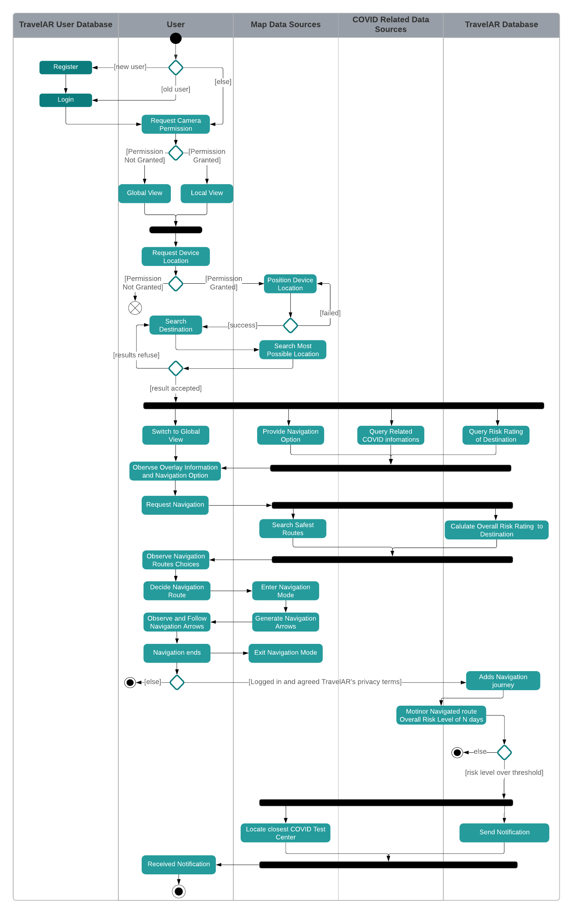
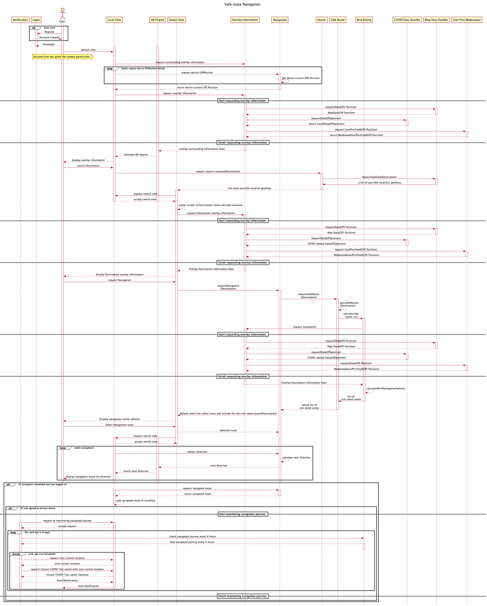
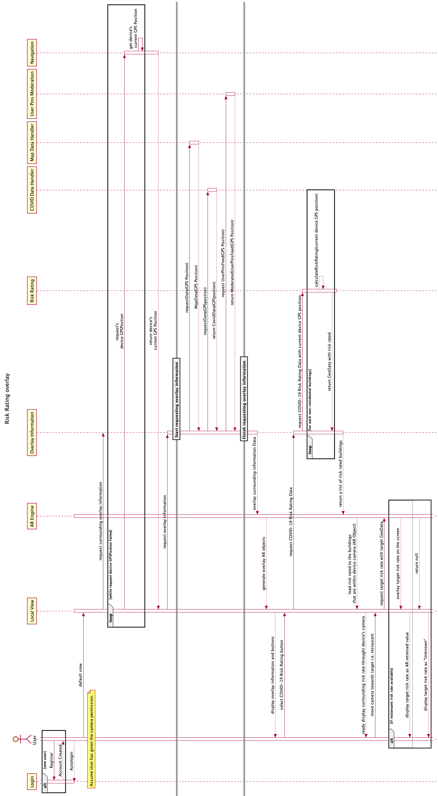

## Software Design with UML(Unit 3):

Use UML to document the analysis and design of your system to a professional level.

1. Provide a comprehensive **Use Case diagram** for your system clearly indicating the actors involved.
   - Make sure you use stereotypes such as <<extend>> and <<include>>.
2. Choose **TWO non-trivial** use cases from your Use Case Diagram described in B1. Document their corresponding actors.
   - Provide meaningful documentation for the chosen two Use Cases using *pre/post conditions*, *flow of events*. (2 Points)
3. Describe **TWO non-trivial** scenarios for each of your chosen use cases. (2 points)
4. Provide an **Activity Diagram** for only for ONE non-trivial scenario of interest. Make sure you use *forks*, *4 swim lanes*, and *conditions*. (1 point)
5. Perform **Class Analysis**: (2 point)
   - Perform **noun-verb analysis** over your specification: Identify the potential classes and potential operations for these classes using what discussed in Lectures. Derive your CRC (i.e., Class, Responsibility, and collaborators)
   - Produce a **First-Cut Class diagram** to combine the consolidated results of using the above two techniques – i.e., noun-verb analysis and responsibility-driven analysis.
   - Detail your **Class Diagram**. This should provide details on attributes, operations, relationships, visibility, multiplicity, etc) (refer to the class notes).
6. Provide an Object Diagram for ONE non-trivial scenario of interest. (1 point)

7. Provide **TWO Sequence Diagrams**, each describing a non-trivial scenario of interest. Make sure you use *guards*, *envelopes*, etc. State any assumption you make. (2 points)
8. Provide **TWO State Diagrams**, each describing non-trivial scenarios of interest. Make sure you use *guards*, *envelopes*, *parallel states* etc. State any assumption you make. (2 points)

For the above questions that require modelling a non-trivial scenarios, you may model the non-trivial ones that were documented as part of the Use Case modelling and scenarios generation exercise as this can simplify your work. Please ensure consistency with your description as much as possible.

## B1

> B1. Provide a comprehensive Use Case diagramfor your system clearly indicating the actors involved. Make sure you use stereotypes such as <<extend>> and <<include>>. (2points)

## B2

>B2. Choose **TWO non-trivial** use cases from your Use Case Diagram described in B1. Document their corresponding actors. Provide meaningful documentation for the chosen two Use Cases using *pre/post conditions*, *flow of events*. (2 Points)

### Use Case Description - global view and navigation

User searches for a destination from global view and navigates to the destination.

### Preconditions

- User is connected to the internet.
- User has installed TravelAR on their device.
- User device is compatible to the TravelAR production environment specification.
- User allows TravelAR to access their device camera.
- User allows TravelAR to access their device GPS location.
- Map data sources is available.
- COVID data sources is available

### Flow of events

1. User opens TravelAR.
   1. If camera permission is granted, TravelAR displays the local view (AR interface) by using the device's camera.
   2. If camera permission is not granted, the default screen will be a global view (Map interface).
2. TravelAR starts positioning the user device's location.
   1. If positioning is successful, TravelAR loads the surrounding overlay information and user pin feed.
   2. If positioning fails, user is presented a message window which indicates positioning failure and ask whether the user wants to retry.
3. User switches to global view.
4. User inputs the destination in the search bar.
5. TravelAR fetches the map data from the Map data sources and starts searching from the available data.
   1. If the destination is available, TravelAR returns the searched result as the destination.
   2. If the destination is not available, TravelAR returns the most possible search result.
6. The returned search result is centered to the device's screen. The location's overlay information: risk level, user pin feed, and navigation option.
7. User selects navigation option.
8. TravelAR enters navigation mode.
9. TravelAR's safest route algorithm formulates several safest routes to the destination by evaluating the overall COVID risk level of the route's bypassing aeras/locations.
   1. Routes are displayed as selection with estimated time and overall risk ratio for user's reference.
10. By default, TravelAR selects the user with the safest route.
    1. However, user can manually select another relatively risky route which are suggested by the safest route algorithm.
11. Navigation route is decided.
    1. If camera permission is granted, the user screen is redirected to the local view and navigation arrow appear in the local view for directing the user to the destination. Other location's overlay information or user pin of the local view is available during the navigation.
    2. If camera permission is not granted, the user's screen remains in the global view. Navigation arrow appears on the current user location of the map for direct user to the destination.
12. User follows the navigation and arrives at the destination.
    1. If the user did not follow the decided route of navigation, the safest routing algorithm reformulates another safest route based on user current location and uses the navigation arrow to redirect the user to the destination.
13. User arrives at their destination.
14. TravelAR shows navigation completion message and exits navigation mode automatically.
    1. User could manually exit navigation mode at any time by selecting the exit navigation option.

### Post conditions

If user is logged in and agrees with the privacy term of TravelAR:

1. The used route is recorded and stored in TravelAR's Database as soon as exiting navigation mode.
2. The navigated journey will be added to the user account's travel history for further reference.
3. Within a period of time, the overall risk ratio of the navigated journey will be monitored. If the journey's risk level exceeds a threshold, user will be notified for a COVID test in the nearest test centre.

### Actors

Involved actors are the following:

1. User (Traveler)
2. TravelAR user database
3. COVID-19 data sources
4. TravelAR Database
5. Map data sources

The primary actor in this use case is the user who wants to travel to a destination during the pandemic period but also wants to minimise the risk of contracting COVID.

The use case also repeatedly involves several data sources providers. For example, the search of a destination involves the map data source for fetching the destination on the map.

After successfully locating the destination, the overlay information is displayed to describe the destination risk level and other user pin feed. Moreover, since the navigation route is formulated by the safest route algorithm COVID-19 data sources and TravelAR Database are involved.

Lastly, if the user is a registered user, agrees with TravelAR's privacy term and logged in for the navigation. It involves the TravelAR user Database after the navigation completion for recording the journey. The aftermath monitoring will again involve the COVID-19 data sources and TravelAR Database. If the risk level exceeds a certain threshold, the closest COVID test center notification is triggered and the map data source is involved again.

## B3

### Scenario

A traveler named Alex would like to go to University of Birmingham from his hotel. He has an IPhoneX which has installed TravelAR and has access to 4G internet connection. He is a registered user of TravelAR so it will automatically log him in after his resignation. He also has given the app permission to access the camera, agreed to the app to access his device's location and agreed to the privacy term. He turns on his IPhoneX and opens TravelAR by selecting its icon. TravelAR displays the local view through his camera by default and located he current location by GPS position. he switches to the global view and type in his desired destination: University of Birmingham. TravelAR successfully fetched the University geodata and the screen is centered to the university location on the map.

The overlay information window is presented along with the centering process and the navigation button is included in the information window. He selected the navigation button and the app suggested 3 routes to him. The route's risk level and estimated traveling time with common travelling method in covid e.g. walk, bicycle, private car is shown in every route respectively. The safest route is placed at the 1st and is suggested by TravelAR.

He chooses the safest route on foot. TravelAR enters the navigation mode, and the screen is redirected back to the local view. He observes an navigation arrow from the AR interface, and He follows the arrow direction and walks to the university.

The app exits navigation mode and records the navigation journey. The journey was recorded to the TravelAR account's navigation history. After a week, he is back to Manchester. Since there was an outbreak of COVID infection near by the route that he was navigated, he receives a notification for getting a COVID test and is suggested the closest COVID Test center by TravelAR.

## B4

>B4. Provide an Activity Diagram for only for ONE non-trivial scenario of interest. Make sure you use forks, 4 swim lanes, and conditions. (1point)

The following activity diagram illustrates the **safe route and navigation scanario**. It follows the previous preassumptions.

## B7

> B7. Provide TWO Sequence Diagrams, each describing a non-trivial scenario of interest.Make sure you use guards, envelopes, etc.State any assumption you make.

The following squence diagram describes the **safe route and navigation scenario**. For simplicity, We assume all previous assumptions as in use case diagram.

The following squence diagram describes the **risk rating overlay scenario**. For simplicity, We assume all previous assumptions as in use case diagram.

## B8
> B8. Provide TWO State Diagrams, each describing non-trivial scenarios of interest. Make sure you use guards, envelopes, parallel states etc.State any assumption you make.

The following state diagram describes the **safe route and navigation scenario**. For simplicity, We assume all previous assumptions as in use case diagram.
![B7StDia1](https://www.plantuml.com/plantuml/svg/fLZDRjms4BxhANWpKCH1d5DXk44Skp6sI6B3Q-TI5m5NcjrbGf4gIQspQF8kVPO-MMT8IY8bRPgsGB2HED_yVHmEHtvf7JUkhILxTRyyVlNZCRuxk1Jyf2Zi9w4QRdZDbculWLbdH4dOueWDiWhMl9Nk3ZwxSoasgWRbM8a_O3BS4dvlGPNm5gpb6_1OLWa3fHDQ9SwaKE3s3J1jt5QpejYA2XZKZTkZCriQqNWDD5vo3ElasRDdx55KRbiKJZXSML8E39FOaBrZLcwXHFCRPeJzn0m9KLl2sZ6dSN6pTKaaXQU0lT4ReTWV1MFX_Tw2kQEmpixAhHObl7ZHozx18udxzrlO28i4G3MxpBsVPFN26vopJFe-abCcrgp5DoOiC-1Qe_ph4_QWt1RN0lvHICbMm1fkBLGFY54I2MUyTLlS4r5wtspDXOJgQU_cF1DdoxTWSNlpsF1VJyVnyOjfllc2n_IPHEN0BqacpiVc1thZK-QqqyhUEqHWDaWZozE0JrcfwqQ2Wsg2F5TQxMlTsW1KsYLWHEV1z_a4rg8yKZZADN9pocnRbhH7KtIo-s77YgzTULvGJT-0gOMrv9WAjTksgvlb89chhGvumMlawv-mtbLcqmStuyN3vxnFyE-qkp8ScqGLEDs4bwc10UYD_Fh3Rz_lfFTmq7fgsgSvPcGWO2m9EhC41gLvRkUqXXo_eVdNdtEgdLvV5qkGsCVk5sddMdoZlom-lD7OHjyBU3nbvxViPuNb1enZBzmXm3uettJq2dztW6scD00A-upR4bolFgAxrDoLrAlEtlDBzfOtJD1biEObZ8rnLlFcGL7xAbjZwEQGEfuaJk8AIyExuds3vf9nO_GZDOb5GcgQoOni28kuYcJTQ2l86TqDwG6wNZakr2NiqC0Lw4lk-2b6JOi-eGeNwEfeeZxUImJjaq0THafJaxWOp_VyYGm-AH5VkB4rh5ifzu4QB5Ri81E7Dyi-c8arBA_NkbLLQ28Kzx-nT4HdphCumuf7pAod-27b53si4ZGFrEFofUy9OCvaPF8m39F3ziyLDQ50IyfAemLIeTKJnbSuZWp7BDYwte6HVBzGQstgKBPKHXrXIsU0rnTw9wfRa1H737bUu7LkkB4me_BboyGmLc9cBxuFPWR0Z3RTBJT2lOPHLAFrmTfOuUimASLZz-407t6Ok0NVMzveNeKJbRGRnUNU1kfBt-AOg75AV51efjpwzLfRHwLfnGfdFBx3MkRqPBghDdTpOpGTdTHBWqi63NXp4iF08w13oE58u_4UHu3Z5SVoguHj2ERTabVjXr0xSNiPWDT1d7hlF0sHHniCsGgZ7Kx8PiyEsGoapLYac0UhTDcrldGYDTRFAIFsmpIISvN0uag6obDBmBbWJYU4xkSTwoyeXgMHfc_ewy0wQiH-9oBVw0GF9eHPNQ_dpIver-WAuR62niO4tc91qC__Q8lcvdwlyIjeGoCTMxL2LgWvbFTmStoxll6q3QLDjmHEwGO4tNFagA4pDAet38kI7nhEaSqQSNSPfZxwkYONJTmcAb6-sHZOT0rihho_ivIfROogs5zwKQyHQgZOk9juf_ZQdR4HgvOifFLQ0mPqSVr-SHbYyncCJqR6JqbS7Y3eQVXgIBR0L-50Ln2cLJt9Ca3ojHoOL74fHVdfFnRnsE3_gz_HtEIdcwxJTrzHCMZTuEHsP_WEvFbjh6xQHVkBnZqzE_k8_-4q4WKYNyq-XBprNhMOVjNayi59FsXdOtXnU2AUcTyEpC0H6KVmJ2M4unCgqZanNO_v7fepid4YGKrRGkJF_z7XVb5EHk-3emCPpRJYjjMQUaXiLBZh-f6RYgPZt95ZRF6Y0cK5piLzxyfzf_ruw53uYV1JkBgPPtMgapKq3m-C1lmHSQrnM2leCVrSnqem-nCSc6NbQm3b-9X-kdl4S_pomos82FWitBaNljOQt_7t9C4MBq5LRIt_1W00)

The following state diagram describes the **risk rating overlay scenario**. For simplicity, We assume all previous assumptions as in use case diagram.
![B7StDia2](https://www.plantuml.com/plantuml/svg/jLdDZXit4hxtK_1cOE49x9m28J4ocOaD1VPOa6PooIm2ghiaqMwH2abfB6poBlii-sHRHRBvqp_ov11WB7UJN_spYaNsZyPoRO_xbltqiBhwwRihVBTmA_ZhgZAVXJnmpVTiPSyjC6Erg0bRlM1fhe4DFxRs7hxOwrPivHwaPJN-W2vmA_ZZ2BA63s0CtuB3iaPegArGCXFM2WdsV02cjDqfLbKxqG23_S6UKPYfjJWu2cHUSrJhzQjNhzYJQEokggomEB8Y6nWQiIL-Lypm3J2jZZWe-KbiET4pPD32nZAhc1RRdSsKgPmNs7kr5PBzfsBClpyOqFUasVVVrpibQdZp9ixTmHDDn_SbR8L17q0pEknKo4Tl7CCnpaJlD9aniM57V6F2C0tsgALxVSaUfTtXcCS_YRPbQs07RWmqZuYHBVgSyQFTOLX4xStVSD52yqqKSrrC5yDBC1ZXKZVyY-wukdepjBSSS9XeII3s_gMPWV0---JUy5G8xQYAzmxXFUjdWvU72izOhVQ75Ymq0-IrLFAyLqVZWLBP38peKlbeZ_TQc0ykxDaQV3DZvbZN5ACXEek-ZrZrLxSyRtPGVrw0tWjZI30jr2vixnQhD3EsjZhW3T-Zlxw6TQ8Adawv4IaEFYPzWBzJzftcM2SQxzEjVnaoI437vBT__VlvGgA4IUuvQsTctoF90VqPJpFgG4yqxjingcJZ1Sh__NUCjAEBws85BTQnXtbUkUONwilyz_SAA-cl0fvcx7h9VfQut81nh8Kd19X7wOgEMkFl2R3Cr1f0OfsnEuAhzISKbxDxrwfrn-_RM_Q17vYW_M33Q-WpuspF3u-IobTzr9esZrQ5JE8qtU3ISA9uBD2yPLnhzKH5OfuvDRTaP2wfHRuApbee8qYOaDiYWJwkBHVo5ax8u1seMsxv3BMcGMTGWmEqTHm2FMvD18r680qZeY5B70pvFPwHNYOPuXPkA0sROzkUlMjmiM856GXShA8o0swulDwgesny4I6z_mwd5vHppeiZNd68aV4SdqpEqMcKeAMY3bSEFKU1CPR1azCmD0xBFvTKXBnRSgySb41NAFcIyJLs92dDFA-F9z0jFy_bHkczNxQqZ3g7hQm6lhzH9z4ieIKzWihZ4uvcmRM14P8__nmmnfLOy0llYKq2Z53Jth8GyYtqjEgD9svzWhzIfnJIxlS9VuHcOWckjhnNlF4PbPKRoTkpyQwlNObZOe-DugD4DlNEZU-LiRGqZLXZcyTFk9OvFUbkgot5BBIYrCcb77188mF7haKrC0MKLzcdDAPtNmDihpWklqQO0y6SM9AgN1zg1c9lFV2ZdywbTvAIve47Gs_vrWwRP7rchgteESit3wLf6IoC5AXIanIkL0alnmjNJmeLLJtiEZK8gjlaf0EjYPx_iDyaMr82lJ15OUcAUouZneb4788Tv7A-tMhOTWav5gvdXeRIe1SLLyG3tK78507Zja-gaIuMlXdDFE4ydBJsaxdt1yBohPdhUjVjDNaTIOdQ7Gc2fs_1M26Tp-8-DD_GIQWRfkC0rQwDg_0OW39DudQAC3ImyGOLKdrDSBfbugWUzCT2wpofczjPgt8BZPXdrSeCFrasBs1IiRhCQAGSPWJzkZgS6fLpiTfckAd2EmqP5JTPZZFCvGJFW2dH_u4ap-J4PFz74ZqJT2dX_ML087w9HRzkZmsbvLsy7tWvg0XAvnLXn7MXwUYRMeBpIZ6fRGhb4ZKjwyLRZ2EDGhBQlLxZSTyOkdw9u-QutQA8YCQ_HErJUK3P6_4Bc6_0ZVkZHQWDWq67BML6Ev9ZYvo_rnpFLNxfO1CHM8zapnryiIkh3fCrOGgGCkS2Ymi2-wMWDpvaFr44oF44MOIwx1mK0Z8Ozx4HvlCIbVpvnDjZlE8O37hkMkqf8C7nVU5XTTrsDroylQO3bC4b4IFq0Gz1LkboiIsXLhe9mOFc5tNK4ivK8sYykqx3PFtaPsZRn9YUeCMkXzomvWOYjuQVbx2d8zJ8EJJ8znAZABBtFI0_kg6HY9GMpq4r7STThT017XNGIC1QeeYSgP3Sxx19tAcsoKMxgvun0_q-VbaXslWl8noNQFCpyOMois2fsE2cxcZxbkhEGFI61cSW2YejBjIOiJMqwid1tJJ2KroUOVSiquOM2xKUPx3iZjYO0JTtkihWtTLPLXgK5PlkzgpV5_dxhzvsagOCbWvgUv1pluDAe9jMOJcpz_ZlnbzCnrjR4dqc3AOXpS-mvS5znfLzig7DkwLSb-mqEgd7fUaU_PYA5sRzdMXVUN9fb_7TxUdCFU5M1p8cPl0x6Mb-KIuRF-5_c11XGfIZnGMeunv9g-5jPZcVXCGBjkBwhPg-2Hkvjvcu-mh8SFLMa7Xrd45LVZ-KZmTxf-uNYck433Nih8B_NCu-pEl1bTlabG4nBQX2s9xGF2gfQyXABRxplF-lIddv0J0rTGzpzeC_fZFdoI5DSTXpSEz5ZmyDXJiFz5R7w67Jzm8HFkiwAHf06wYtAeqOd9h-DeTCkHIaBXild5cAm5yuhEJH3IqBkcaGtii77fHLCgXw_9pLJyBMktlb0p2BlNK_Y2Mktr9sqHoJCDhu5sBou4_sgR6pyUrUY96cJtt6ci7AVPGuuayDMTZoXZ4eLuicD4ZPiozwiO-iifQodBc9NsVoV8mVdBA8ZT1akPW-lSHTkFlyXkDRnCwxv2k-Phajxo4WQNiCQ27x2YsqEF7wV8sd7t3TTgRR2ED9kYGkYPeMactok25vMZpISG9Gq1xJLi42COlKN-4RRKScZG9ll-FyLSQzfkNDoAuxIwsExrq6Us1IGkPjHVfWzu8s2YMRggB7_1iZwg3Fhr54wni0dCV7_7kZGtoBh77_20Zu8knrI0E5x_ZxEiDMFs8xSTot_mS0)

## Resources and Tools

- [PLantUML](https://plantuml.com/)
- [Lucidchart](https://lucid.co/product/lucidchart)